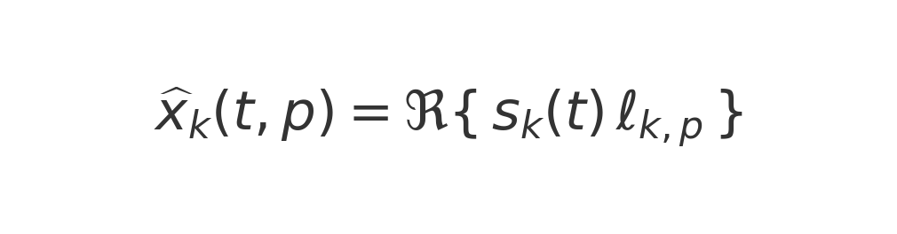
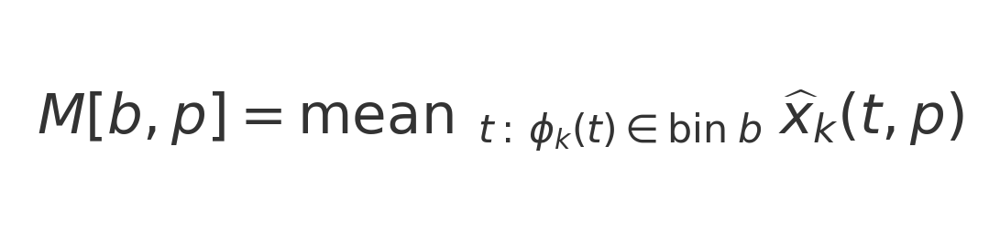

# Complex PCA and Guided cPCA: Outputs and Interpretation (image-backed equations)

## Summary
Complex PCA (cPCA) is applied to analytic (complex) BOLD signals to obtain complex components (time courses and spatial loadings with phase). The reconstruction produces a matrix with dimensions (bins x parcels), where each entry represents a z-scored BOLD level at a given phase bin of one oscillatory cycle. Guided cPCA augments the subject covariance with a low-rank prior aligned to group templates, which encourages but does not force alignment.

## 1) Data and normalization
When `--normalize zscore` is used, each parcel is standardized:

Analytic (complex) signals are then formed via the Hilbert transform, and cPCA is applied to X.

## 2) cPCA via SVD
The singular value decomposition is

Definitions:
- Component time courses (complex scores): s_k(t) = (UΣ)_{t,k}.
- Spatial loadings (complex): ℓ_{k,p} from columns of V (with the script’s scaling).
- Explained variance (eigenvalues of the covariance): λ_k = σ_k²/(T−1), real and non‑negative.

Interpretation:
- |ℓ_{k,p}| indicates the participation strength of parcel p in component k.
- arg(ℓ_{k,p}) indicates the phase lag or lead of parcel p relative to the component time course.
- λ_k quantifies the total variance captured by component k; it is not written into the reconstruction matrix directly.

## 3) Reconstruction and phase binning
For a component k, the contribution to parcel p at time t is, up to consistent scaling,

The phase of the component is φ_k(t) = arg s_k(t). The interval [−π, π) is divided into N bins (e.g., N=30), and values are averaged within each bin to form

Shapes and units:
- M has shape (bins x parcels); for BNA-246 and N=30, this is 30 x 246.
- Entries of M are in z-units (standard deviations relative to each parcel’s mean) because inputs were z-scored.
- Rows correspond to phase snapshots across one cycle; columns correspond to parcels.
- A parcel’s reconstructed waveform across the cycle is a column of M.
- These values are phase‑conditioned mean amplitudes, not correlations and not eigenvalues.

## 4) Mapping bins to seconds
If the dominant frequency is f Hz, the period is 1/f seconds, and

## 5) Guided cPCA
The subject covariance is

Guided cPCA forms

Here, λ contains non‑negative guidance weights (variance units), one per template direction. An eigendecomposition of C_guided yields guided components. The script selects the smallest λ (from a grid scaled to data variance) that achieves a target template–component similarity, which encourages but does not force alignment. Guided components are matched and phase‑aligned to templates, and subject time courses are obtained by projection, S = X_c U.

## Notes
- λ is not the eigenvalue of the group component; it is a guidance weight controlling the strength of the prior.
- As λ → 0, ordinary cPCA is recovered; larger λ increases alignment to the template.
- This workflow can be run without global signal regression; phase opposition within a component accounts for “anticorrelations.”
